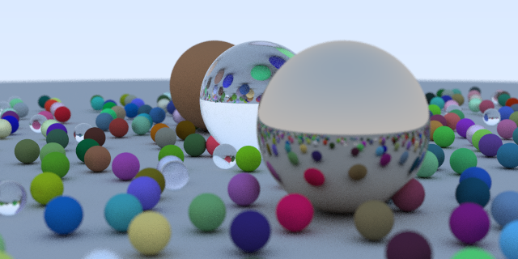

# RTUT

## What's this?

RTUT is a weekend ray tracer on Unity, which is following [@Peter_shirley](https://twitter.com/Peter_shirley)'s textbook.

## TODO

* [x] Ray Tracing in One Weekend (Ray Tracing Minibooks Book 1)
* [ ] Ray Tracing: the Next Week (Ray Tracing Minibooks Book 2)
* [ ] Ray Tracing: The Rest Of Your Life (Ray Tracing Minibooks Book 3)

## LICENSE

This software is released under the MIT License, see LICENSE.txt.

## Other versions
* [C# Job System](../../tree/use-jobsystem) ⚡
* [Compute Shader](../../tree/use-computeshader) ⚡⚡⚡
